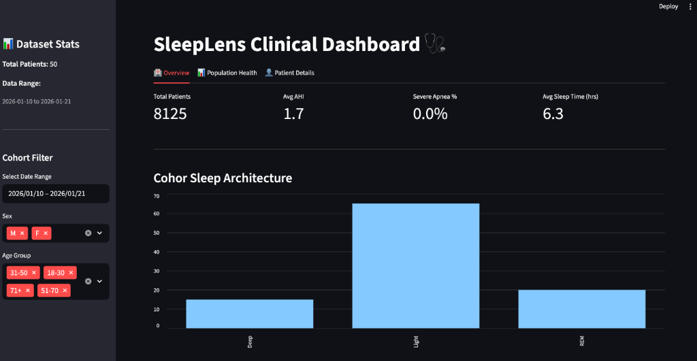
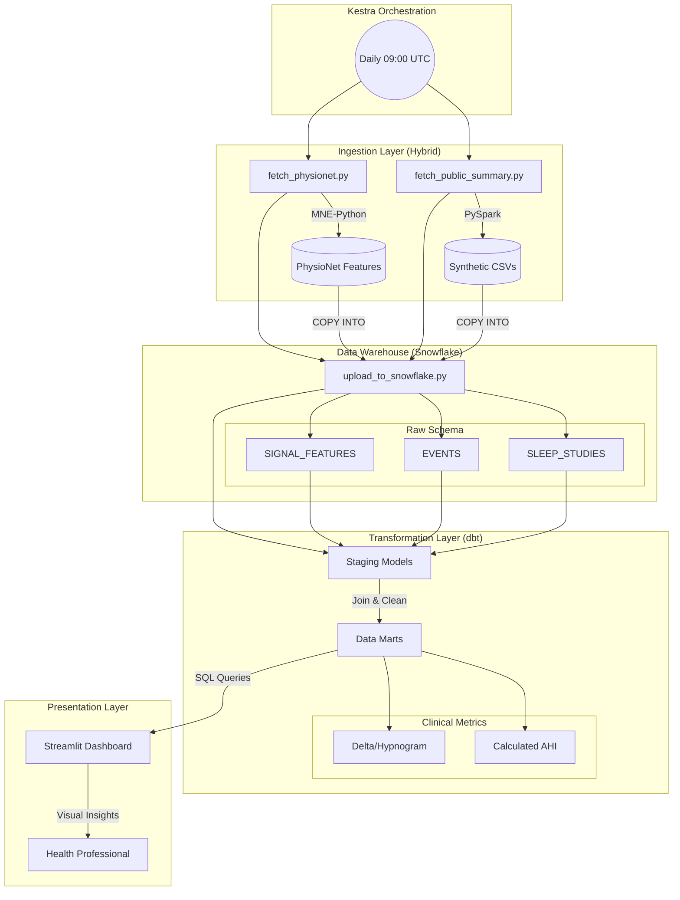

# 🌙 SleepLens: Clinical Sleep Data Analytics Platform

**SleepLens** is a modern, end-to-end data engineering project designed to ingest, process, and visualize large-scale sleep study data. It provides health professionals with a clinical-grade dashboard to analyze patient sleep architecture, detect apnea events, and monitor population health trends.




## 🏗️ Architecture

The pipeline follows a modern ELT (Extract, Load, Transform) architecture orchestrated by **Kestra**.



### Data Flow
1.  **Ingestion (Hybrid)**:
    *   **Synthetic Path**: `fetch_public_summary.py` uses **PySpark** to generate massive-scale summary data (mimicking 12,000+ daily summaries).
    *   **Scientific Path**: `fetch_physionet.py` uses **MNE-Python** to process real PSG signals (EDF files) and extract spectral features (Delta/Theta power).
2.  **Loading**: `upload_to_snowflake.py` consolidates both data streams into the **Snowflake** Data Cloud (`RAW` schema).
3.  **Transformation**: **dbt** (Data Build Tool) transforms raw data into analytics-ready models:
    *   **Staging**: Cleans and normalizes raw tables (`stg_sleep_studies`, `stg_signal_features`).
    *   **Marts**: Creates business logic tables like `fct_sleep_summary` and `fct_signal_analytics`.
4.  **Orchestration**: **Kestra** schedules and manages the entire dependency graph, running daily.
5.  **Visualization**: A **Streamlit** dashboard connects directly to Snowflake to present clinical insights (AHI, Hypnograms).

## 🛠️ Tech Stack

*   **Orchestration**: Kestra (Dockerized)
*   **Ingestion**: Apache Spark (PySpark) & MNE-Python
*   **Data Warehouse**: Snowflake
*   **Transformation**: dbt Core
*   **Language**: Python 3.12
*   **Visualization**: Streamlit
*   **Infrastructure**: Docker, Docker Compose, Terraform (AWS)

## 🚀 Getting Started

### Prerequisites
*   Docker & Docker Compose
*   Snowflake Account (Trial or Standard)

### Installation

1.  **Clone the repository**:
    ```bash
    git clone https://github.com/kahramanmurat/sleeplens.git
    cd sleeplens
    ```

2.  **Configure Credentials**:
    Update `transformations/dbt/profiles.yml` with your Snowflake credentials.

3.  **Start Services**:
    ```bash
    docker compose -f docker/docker-compose.yml up -d
    ```

### Usage

#### 1. Run the Pipeline (Automated)
You can trigger the full end-to-end pipeline using the helper script:
```bash
./scripts/run_snowflake.sh
```

#### 2. Run Automation (Kestra)
Access the Kestra UI at `http://localhost:8081`. 
*   **Username**: `admin`
*   **Password**: `admin`
*   Trigger the `sleeplens_pipeline` flow to see the orchestration in action.

#### 3. Launch Dashboard
Run the clinical dashboard to view the results:
```bash
uv run streamlit run dashboard/app.py
```

## 🔄 CI/CD Pipeline

This project uses **GitHub Actions** for Continuous Integration:
*   **Linting**: Enforces code quality with `flake8` (Python) and `sqlfluff` (SQL).
*   **Validation**: Runs `dbt compile` to ensure model integrity.
*   **Build**: Verifies Docker image compilation.

### 🔐 Secrets Configuration
To enable the CI pipeline to compile dbt models against your Snowflake account, add the following **Repository Secrets** within GitHub (Settings -> Secrets and variables -> Actions):

| Secret Name | Description |
|---|---|
| `SNOWFLAKE_ACCOUNT` | Your Snowflake account identifier (e.g., `xy12345.us-east-1`) |
| `SNOWFLAKE_USER` | Service account username |
| `SNOWFLAKE_PASSWORD` | Service account password |
| `SNOWFLAKE_ROLE` | Role for dbt operations (e.g., `ACCOUNTADMIN` or custom role) |
| `SNOWFLAKE_WAREHOUSE` | Compute warehouse (e.g., `COMPUTE_WH`) |
| `SNOWFLAKE_DATABASE` | Target database (e.g., `SLEEPLENS`) |
| `SNOWFLAKE_SCHEMA` | Target schema (e.g., `RAW`) |

## 📊 Dashboard Features

The dashboard is designed for health professionals and includes:
*   **Clinical Overview**: Real-time calculation of **Apnea-Hypopnea Index (AHI)**.
*   **Population Health**: Analysis of sleep disorders across age and sex cohorts.
*   **Patient Drill-Down**: Individual patient scorecards comparing their sleep architecture to population averages.
