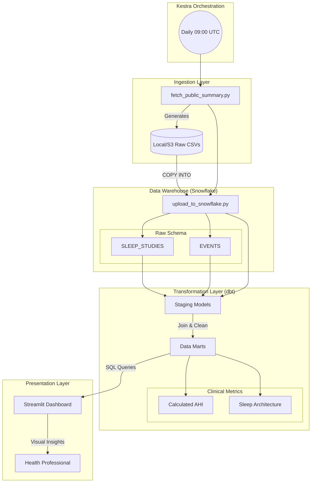

```mermaid
graph TD
    subgraph Orchestration [Kestra Orchestration]
        DailyTrigger((Daily 09:00 UTC))
    end

    subgraph "Ingestion Layer"
        Script[fetch_public_summary.py]
        RawData[(Local/S3 Raw CSVs)]
        Script -->|Generates| RawData
    end

    subgraph "Data Warehouse (Snowflake)"
        SnowPy[upload_to_snowflake.py]
        
        subgraph "Raw Schema"
            RawSummary[SLEEP_STUDIES]
            RawEvents[EVENTS]
        end
        
        RawData -->|COPY INTO| SnowPy
        SnowPy --> RawSummary
        SnowPy --> RawEvents
    end

    subgraph "Transformation Layer (dbt)"
        Staging[Staging Models]
        Marts[Data Marts]
        
        RawSummary --> Staging
        RawEvents --> Staging
        Staging -->|Join & Clean| Marts
        
        subgraph "Clinical Metrics"
            AHI[Calculated AHI]
            SleepArch[Sleep Architecture]
        end
        
        Marts --> AHI
        Marts --> SleepArch
    end

    subgraph "Presentation Layer"
        Streamlit[Streamlit Dashboard]
        User[Health Professional]
        
        Marts -->|SQL Queries| Streamlit
        Streamlit -->|Visual Insights| User
    end

    DailyTrigger --> Script
    Script --> SnowPy
    SnowPy --> Staging
```
